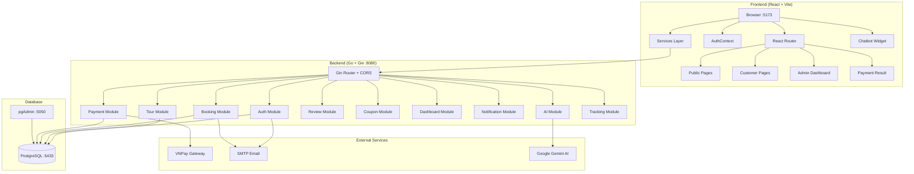
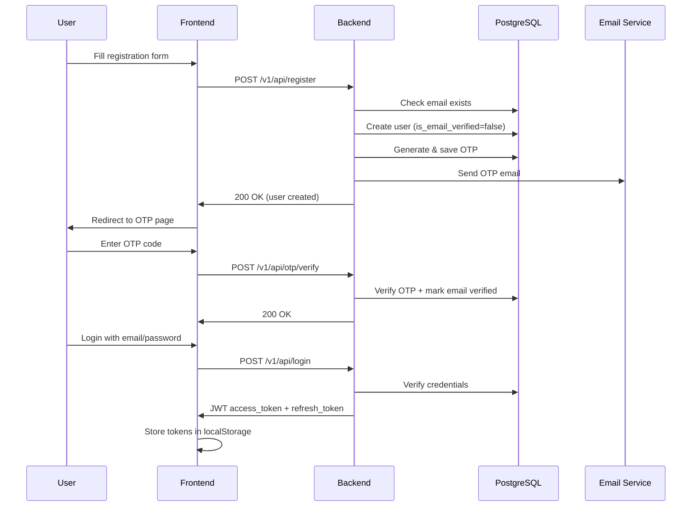
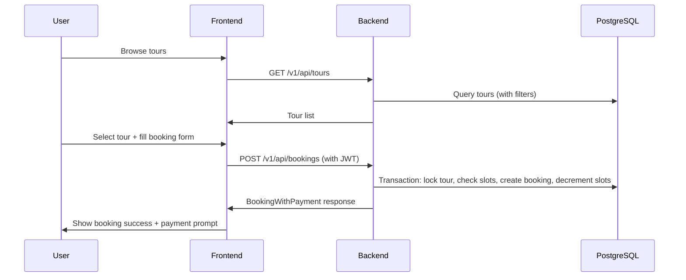
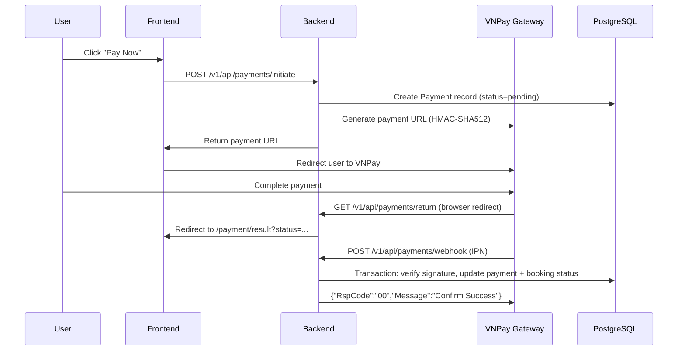
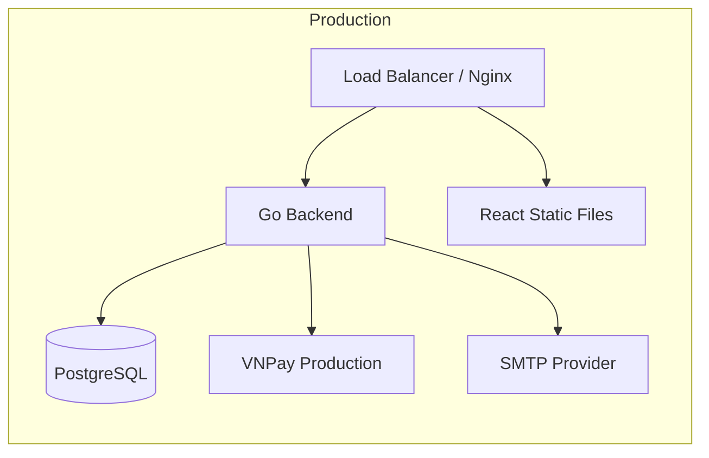

# Traveling System — Complete Review & Deployment Roadmap

## System Architecture Overview



---

## Complete Process Flow

### 1. User Registration & Authentication



### 2. Tour Browsing & Booking



### 3. Payment Flow (VNPay Integration)



---

## Bugs & Issues Found

### 🔴 Critical Bugs

| # | Issue | Location | Impact |
|---|-------|----------|--------|
| 1 | **VNPay Secret Key validation fails on startup** | [backend.log:12](file:///home/trung/Documents/Traveling/server/backend.log#L12) | Payment module falls back to `DEMO_SECRET_KEY`, all real payments will fail signature validation. The `.env` has `VNPAY_SECRET_KEY=RAO0S90SJYST6VQRCMU6T77Y5F6NVS6G` (32 chars) but config validator requires `≥16` chars. **Root cause:** The config in `.env` uses `VNPAY_SECRET_KEY` but the validation error says 15 chars — this means the env var is NOT being loaded properly (likely a whitespace/encoding issue or the env file wasn't loaded at the time of VNPay config initialization). |
| 2 | **TravelDate format mismatch** | [service.go:341](file:///home/trung/Documents/Traveling/server/internal/booking/service.go#L341) vs [service.go:61](file:///home/trung/Documents/Traveling/server/internal/booking/service.go#L61) | `validateBookingRequest` expects `YYYY-MM-DD` format but `ScheduleID` path overwrites with `DD/MM/YYYY` format on line 61. If a booking uses a schedule, the stored `TravelDate` will be in `DD/MM/YYYY` which breaks future date comparisons. |
| 3 | **Hardcoded localhost URLs in email templates** | [email.go:122](file:///home/trung/Documents/Traveling/server/internal/shared/email.go#L122), [email.go:173](file:///home/trung/Documents/Traveling/server/internal/shared/email.go#L173) | Password reset URL and booking confirmation link point to `http://localhost:5173`. Will break in production. Should use `FRONTEND_BASE_URL`. |
| 4 | **CORS allows single origin only** | [main.go:83](file:///home/trung/Documents/Traveling/server/cmd/server/main.go#L83) | `AllowOrigins` only permits `FRONTEND_BASE_URL`. If deploying frontend on a different domain (e.g., CDN), API calls will be blocked. |
| 5 | **Duplicate API requests** | [backend.log:81-84](file:///home/trung/Documents/Traveling/server/backend.log#L81-L84) | Logs show every API call is fired 2-4x simultaneously. Frontend likely has duplicate effect triggers or StrictMode double-renders causing real network calls. |

### 🟡 Medium Bugs

| # | Issue | Location | Impact |
|---|-------|----------|--------|
| 6 | **`paymentService.js` doesn't use shared `httpClient`** | [paymentService.js:1](file:///home/trung/Documents/Traveling/client/src/services/paymentService.js#L1) | Creates its own `axios` instance without interceptors, bypassing the central auth token injection. Token refresh won't work for payment API calls. |
| 7 | **403 on public tour endpoints** | [backend.log:250-257](file:///home/trung/Documents/Traveling/server/backend.log#L250-L257) | Public `/v1/api/tours` returned 403 repeatedly. This suggests CORS was misconfigured at that point (wrong `FRONTEND_BASE_URL` or origin mismatch). |
| 8 | **`httpClient.js` has NO auth interceptor** | [httpClient.js](file:///home/trung/Documents/Traveling/client/src/services/httpClient.js) | The shared HTTP client is bare-bones (8 lines). No request interceptor to attach Bearer tokens. Each service manually gets tokens — inconsistent. |
| 9 | **Stub pages remain** | [App.jsx:31-33](file:///home/trung/Documents/Traveling/client/src/App.jsx#L31-L33) | `AccountPasswordPage`, `AdminSchedulesPage`, `AdminPaymentsPage` are placeholder divs. |
| 10 | **Profile page is a stub** | [Profile.jsx](file:///home/trung/Documents/Traveling/client/src/pages/customer/Profile.jsx) (139 bytes) | Likely minimal or placeholder implementation. |
| 11 | **JWT TTL set to 24 hours (1440 min)** | [.env:13](file:///home/trung/Documents/Traveling/server/.env#L13) | Access token valid for 24 hours is too long for production security. Should be 15-30 minutes with refresh flow. |
| 12 | **Booking cancellation doesn't refund schedule slots** | [repository.go:86-99](file:///home/trung/Documents/Traveling/server/internal/booking/repository.go#L86-L99) | Cancel only refunds `Tour.RemainingSlots`, not `TourSchedule.RemainingSlots` when a schedule was used. |
| 13 | **No expired payment cleanup job** | Backend | No cron/scheduler marks expired payments. `GetExpiredPayments()` is defined in the repository interface but never called. |

### 🟢 Minor Issues

| # | Issue | Location |
|---|-------|----------|
| 14 | `travel.db` SQLite file in server root (38KB) — leftover from early development | [server/travel.db](file:///home/trung/Documents/Traveling/server/travel.db) |
| 15 | `main` binary (37MB) committed to repo | [server/main](file:///home/trung/Documents/Traveling/server/main) |
| 16 | `backend.log` and `frontend.log` committed | [server/backend.log](file:///home/trung/Documents/Traveling/server/backend.log) |
| 17 | Gin running in debug mode without trusted proxies warning | [backend.log:76](file:///home/trung/Documents/Traveling/server/backend.log#L76) |
| 18 | Duplicate route registrations (`/login` and `/auth/login` etc.) | [App.jsx:44-55](file:///home/trung/Documents/Traveling/client/src/App.jsx#L44-L55) |
| 19 | `DisableForeignKeyConstraintWhenMigrating: true` hides schema issues | [postgres.go:49](file:///home/trung/Documents/Traveling/server/database/postgres.go#L49) |

---

## Deployment Checklist

### Phase 1: Fix Critical Bugs Before Deploy

- [ ] **Fix VNPay config loading** — Ensure `.env` is loaded before `LoadVNPayConfig()` is called. Debug why secret key shows as 15 chars.
- [ ] **Fix TravelDate format** — Standardize on ISO `YYYY-MM-DD` everywhere (including schedule path).
- [ ] **Use `FRONTEND_BASE_URL` in email templates** — Replace all hardcoded `localhost:5173`.
- [ ] **Fix duplicate API calls** — Audit React components for double-fetch patterns.
- [ ] **Fix `paymentService.js`** to use shared `httpClient` or at minimum attach auth headers from AuthContext.

### Phase 2: Security Hardening

- [ ] **Reduce JWT access TTL** to 15 minutes (`JWT_ACCESS_TTL_MINUTES=15`)
- [ ] **Change default credentials** — Replace `DB_PASSWORD=123456`, JWT secrets
- [ ] **Set `GIN_MODE=release`** in production
- [ ] **Configure trusted proxies** — `r.SetTrustedProxies([]string{"your-proxy-ip"})`
- [ ] **Enable CORS for production domain(s)** — Support multiple origins
- [ ] **Enforce HTTPS** — All VNPay URLs, frontend URL, email links
- [ ] **Remove `.env` secrets from git** — The `.env` with real VNPay sandbox keys is committed
- [ ] **Enable `DB_SSLMODE=require`** for production PostgreSQL
- [ ] **Add rate limiting** to payment endpoints (currently only auth has rate limiting)

### Phase 3: Infrastructure Setup



- [ ] **Create Dockerfile for backend**

```dockerfile
# Example multi-stage Dockerfile
FROM golang:1.25-alpine AS builder
WORKDIR /app
COPY go.mod go.sum ./
RUN go mod download
COPY . .
RUN CGO_ENABLED=0 go build -o server ./cmd/server/main.go

FROM alpine:latest
RUN apk --no-cache add ca-certificates tzdata
WORKDIR /app
COPY --from=builder /app/server .
EXPOSE 8080
CMD ["./server"]
```

- [ ] **Create Dockerfile for frontend**

```dockerfile
FROM node:22-alpine AS builder
WORKDIR /app
COPY package*.json ./
RUN npm ci
COPY . .
RUN npm run build

FROM nginx:alpine
COPY --from=builder /app/dist /usr/share/nginx/html
COPY nginx.conf /etc/nginx/conf.d/default.conf
EXPOSE 80
```

- [ ] **Create `docker-compose.prod.yml`** combining backend + frontend + PostgreSQL
- [ ] **Set up Nginx reverse proxy** with SSL (Let's Encrypt)
- [ ] **Configure production `.env`** with real credentials
- [ ] **Set up CI/CD** — GitHub Actions for build + deploy

### Phase 4: Production Environment Variables

```env
# Production .env template
GIN_MODE=release
DB_HOST=your-db-host
DB_PORT=5432
DB_USER=traveling_prod
DB_PASSWORD=<strong-random-password>
DB_NAME=travel_db
DB_SSLMODE=require

JWT_ACCESS_SECRET=<64-char-random-string>
JWT_REFRESH_SECRET=<64-char-random-string>
JWT_ACCESS_TTL_MINUTES=15
JWT_REFRESH_TTL_HOURS=168

VNPAY_ENVIRONMENT=production
VNPAY_MERCHANT_ID=<production-merchant-id>
VNPAY_SECRET_KEY=<production-secret-key>
VNPAY_RETURN_URL=https://api.yourdomain.com/v1/api/payments/return
VNPAY_IPN_URL=https://api.yourdomain.com/v1/api/payments/webhook
FRONTEND_BASE_URL=https://yourdomain.com
VNPAY_PAYMENT_TIMEOUT=15

EMAIL_ENABLED=true
SMTP_HOST=smtp.gmail.com
SMTP_PORT=587
SMTP_USERNAME=your-email@gmail.com
SMTP_PASSWORD=your-app-password
SMTP_FROM_EMAIL=noreply@yourdomain.com
SMTP_FROM_NAME=Traveling
```

### Phase 5: Pre-Launch Tasks

- [ ] **Add health check endpoint** — `GET /health` returning 200
- [ ] **Add structured logging** — Replace `log.Printf` with JSON logger (e.g., `zerolog`)
- [ ] **Add payment expiry cleanup job** — Goroutine/cron to mark expired payments
- [ ] **Complete stub pages** — AccountPasswordPage, AdminSchedulesPage, AdminPaymentsPage
- [ ] **Build frontend for production** — `npm run build`
- [ ] **Remove debug artifacts** — `travel.db`, `main` binary, `*.log` files
- [ ] **Update `.gitignore`** to exclude build artifacts, `.env`, binaries, logs
- [ ] **Add database backup strategy**
- [ ] **Add monitoring** (uptime checks, error tracking)

---

## Module Completion Status

| Module | Backend | Frontend | Status |
|--------|---------|----------|--------|
| Authentication | ✅ Complete | ✅ Complete | 🟢 Ready |
| Tour Management | ✅ Complete | ✅ Complete | 🟢 Ready |
| Booking | ✅ Complete | ✅ Complete | 🟡 Schedule slot refund bug |
| Payment (VNPay) | ✅ Complete | ✅ Complete | 🔴 Config loading bug |
| Reviews | ✅ Complete | ✅ Complete | 🟢 Ready |
| Coupons | ✅ Complete | ✅ Complete | 🟢 Ready |
| Admin Dashboard | ✅ Complete | ✅ Complete | 🟢 Ready |
| Admin User Mgmt | ✅ Complete | ✅ Complete | 🟢 Ready |
| Notifications | ✅ Complete | ✅ Complete | 🟢 Ready |
| AI Chatbot | ✅ Complete | ✅ Complete | 🟢 Ready |
| Email Service | ✅ Complete | N/A | 🟡 Hardcoded URLs |
| Admin Schedules | ✅ Backend done | ❌ Stub page | 🔴 Incomplete |
| Admin Payments | ❌ No admin endpoints | ❌ Stub page | 🔴 Incomplete |
| Account Password | ✅ Backend done | ❌ Stub page | 🟡 Frontend missing |

**Overall Completion: ~85%** — Core features work, but deployment blockers exist.

---

## Priority Fix Order

1. **VNPay config bug** → Payments are non-functional
2. **TravelDate format** → Data integrity risk
3. **Email hardcoded URLs** → Broken links in production
4. **httpClient auth interceptor** → API calls fail without tokens
5. **Security hardening** → Required before any public deploy
6. **Dockerfiles + CI/CD** → Required for deployment
7. **Complete stub pages** → Polish
