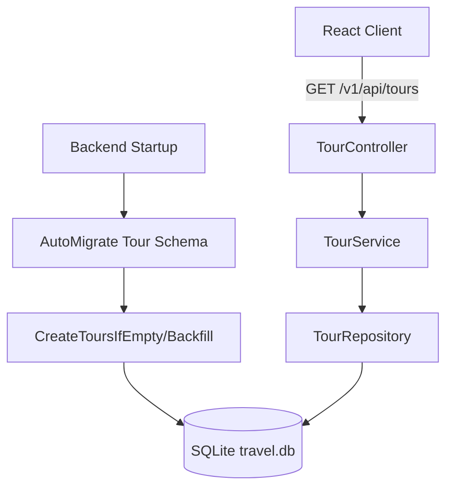

# System Design & Architecture

## Architecture Overview
**What is the high-level system structure?**

- Key components and their responsibilities:
- `main.go`: khởi tạo DB + gọi seed ban đầu.
- `tour_repository.go`: quản lý danh sách seed chuẩn và logic backfill theo tên.
- `tour_service.go`: lọc/sắp xếp dữ liệu đầu ra từ repository.
- `tour_controller.go`: nhận query params và trả JSON.

- Technology stack choices and rationale:
- GORM + SQLite: nhanh cho local dev, dễ auto-migrate.
- Gin: route nhẹ, bind query/body trực tiếp.

## Data Models
**What data do we need to manage?**

- Core entity: `Tour`
- `name`: tên hiển thị tour
- `type`: `domestic` | `international` | `service`
- `country`: quốc gia điểm đến
- `price`, `duration`, `location`, `description`

- Data flow:
- Seed/backfill nạp danh sách tour chuẩn -> kiểm tra tồn tại theo `name` -> update trường chuẩn nếu đã có -> insert nếu chưa có.

## API Design
**How do components communicate?**

- External APIs:
- `GET /v1/api/tours`
- Query:
  - `category`: all/domestic/international/service
  - `city`, `duration`, `price`, `sort`

- Request/response formats:
- Response array `Tour[]` JSON.

- Authentication/authorization approach:
- Public read cho danh sách tour hiện tại (không yêu cầu auth).

## Component Breakdown
**What are the major building blocks?**

- Frontend components:
- `SearchBar.jsx`: gửi filter/sort
- `App.jsx`: gọi API danh sách tour

- Backend services/modules:
- `controllers/tour_controller.go`
- `services/tour_service.go`
- `repositories/tour_repository.go`

- Database/storage layer:
- SQLite runtime (`travel.db`)
- MySQL init script (`init_database.sql`) cho môi trường setup thủ công

## Design Decisions
**Why did we choose this approach?**

- Upsert theo `name` trong seed/backfill để idempotent và an toàn với DB cũ.
- Giữ `price` dạng string để tương thích UI hiện tại; parse số ở tầng service khi lọc/sort.
- Đồng bộ danh sách tour quốc tế ở cả runtime seed và SQL init để tránh lệch môi trường.

## Non-Functional Requirements
**How should the system perform?**

- Performance targets:
- Seed/backfill không tạo trùng và không làm chậm startup đáng kể với dữ liệu nhỏ.

- Scalability considerations:
- Có thể chuyển sang seed bằng mã định danh riêng khi số lượng tour lớn.

- Security requirements:
- Không có dữ liệu nhạy cảm trong seed.

- Reliability/availability needs:
- Seed/backfill phải chạy nhiều lần ổn định (idempotent).
