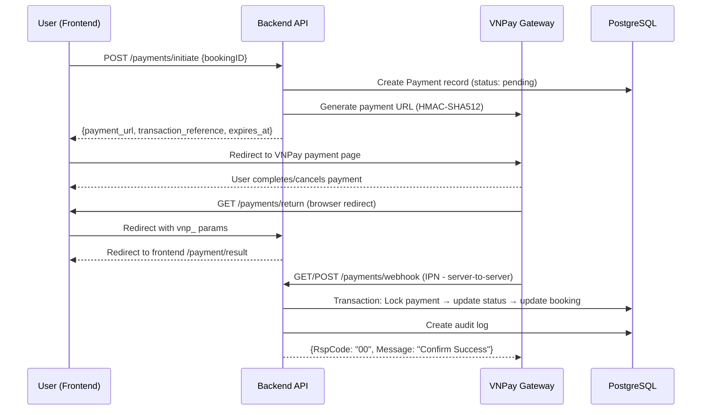

# 💳 Payment Module — Improvement & Enhancement Plan

## 1. Hiện trạng Payment Module

### ✅ Đã implement (hoàn thiện ~85%)

| Component | File | Status |
|---|---|---|
| **VNPay Integration** | `payment/vnpay_client.go` | ✅ HMAC-SHA512 signature, URL generation |
| **Payment Config** | `payment/config.go` | ✅ Env-based config, validation, sandbox/production support |
| **Payment Service** | `payment/service.go` | ✅ Initiate, ProcessReturn, ProcessWebhook, GetStatus |
| **Payment Handler** | `payment/handler.go` | ✅ REST endpoints: initiate, return, webhook, status, booking payments |
| **Payment Repository** | `payment/repository.go` + `repository_impl.go` | ✅ CRUD, transaction support, audit log |
| **Payment Domain** | `domain/payment.go` | ✅ Status transitions, validation, amount formatting |
| **Audit Logging** | `domain/payment_audit_log.go` | ✅ Payment initiated, completed, failed, webhook received |

### Luồng thanh toán hiện tại



---

## 2. Vấn đề cần cải thiện

### 🔴 CRITICAL

| # | Vấn đề | Impact |
|---|---|---|
| P1 | **Webhook idempotency** — Không có idempotency key riêng, chỉ check status != paid | Duplicate webhook → potential double-processing |
| P2 | **Payment expiry job** — Không có background job để expire pending payments | Payments stuck in "pending" forever |
| P3 | **Auto-cancel unpaid bookings** — Booking có `payment_deadline` nhưng không enforce | Slots bị hold vô thời hạn |

### 🟡 HIGH

| # | Vấn đề | Impact |
|---|---|---|
| P4 | **Rate limiting on payment status** — User có thể spam GET /payments/status | DoS risk |
| P5 | **Payment retry logic** — CanRetry() method exists nhưng chưa có retry endpoint | User phải tạo booking mới khi payment fails |
| P6 | **Refund flow** — Status "refunded" defined nhưng chưa implement | Admin không thể refund |

### 🟡 MEDIUM

| # | Vấn đề | Impact |
|---|---|---|
| P7 | **Include payment URL in booking response** — Client phải gọi thêm API | Extra round trip, poor UX |
| P8 | **Payment history cho admin** — Admin không xem được payment audit logs | Thiếu traceability |
| P9 | **Multiple payment methods** — Chỉ VNPay, chưa support MoMo/ZaloPay | Hạn chế user |

---

## 3. Kế hoạch Fix — Chi tiết

### Phase P-1: Critical Fixes (Ưu tiên cao — ~3 giờ)

#### P1: Webhook Idempotency Key

**Hiện tại**: `ProcessWebhook()` check `payment.Status == paid || refunded` để skip duplicate → Đủ cho hầu hết cases, NHƯNG nếu 2 webhooks đến cùng lúc trước khi status cập nhật, cả 2 đều pass check.

**Giải pháp**: Thêm `webhook_id` field vào `PaymentAuditLog` và check duplicate trước khi process.

```go
// File: server/domain/payment_audit_log.go
// ADD field:
type PaymentAuditLog struct {
    // ... existing fields ...
    WebhookID string `json:"webhook_id" gorm:"index;size:100"` // VNPay transaction no + response code
}

// File: server/internal/payment/service.go - ProcessWebhook()
// BEFORE processing, generate and check idempotency key:
webhookID := fmt.Sprintf("%s_%s_%s", txnRef, params["vnp_TransactionNo"], params["vnp_ResponseCode"])

var existingLog domain.PaymentAuditLog
if err := tx.Where("webhook_id = ?", webhookID).First(&existingLog).Error; err == nil {
    // Already processed this exact webhook
    rspCode = "02"
    rspMessage = "Order Already Confirmed"
    return nil
}
```

#### P2: Payment Expiry Background Job

**Giải pháp**: Tạo background goroutine chạy mỗi 1 phút, expire các payment quá `session_expires_at`.

```go
// File: server/internal/payment/expiry_job.go (NEW)
package payment

func StartPaymentExpiryJob(ctx context.Context) {
    ticker := time.NewTicker(1 * time.Minute)
    defer ticker.Stop()

    for {
        select {
        case <-ticker.C:
            expireStalePayments()
        case <-ctx.Done():
            return
        }
    }
}

func expireStalePayments() {
    result := database.DB.Model(&domain.Payment{}).
        Where("status IN (?, ?) AND session_expires_at < ?",
            domain.PaymentStatusPending, domain.PaymentStatusProcessing, time.Now()).
        Updates(map[string]interface{}{
            "status": domain.PaymentStatusExpired,
        })
    
    if result.RowsAffected > 0 {
        log.Printf("[PAYMENT][EXPIRY] Expired %d stale payments", result.RowsAffected)
    }
}
```

#### P3: Auto-cancel Unpaid Bookings

**Giải pháp**: Extend expiry job để cancel bookings quá `payment_deadline`.

```go
// File: server/internal/booking/expiry_job.go (NEW)
package booking

func StartBookingExpiryJob(ctx context.Context) {
    ticker := time.NewTicker(5 * time.Minute)
    defer ticker.Stop()

    for {
        select {
        case <-ticker.C:
            cancelExpiredBookings()
        case <-ctx.Done():
            return
        }
    }
}

func cancelExpiredBookings() {
    var expiredBookings []domain.Booking
    database.DB.Where(
        "status = ? AND payment_status = ? AND payment_deadline < ?",
        "pending", "unpaid", time.Now(),
    ).Find(&expiredBookings)

    for _, booking := range expiredBookings {
        database.DB.Transaction(func(tx *gorm.DB) error {
            // Cancel booking
            tx.Model(&booking).Updates(map[string]interface{}{
                "status": "cancelled",
                "payment_status": "expired",
            })
            // Restore slots
            tx.Model(&domain.Tour{}).Where("id = ?", booking.TourID).
                Update("remaining_slots", gorm.Expr("remaining_slots + ?", booking.Quantity))
            return nil
        })
    }
}
```

---

### Phase P-2: High Priority Improvements (~2 giờ)

#### P4: Rate Limiting on Payment Status Endpoint

```go
// File: server/cmd/server/main.go
// Tạo rate limiter riêng cho payment endpoints
paymentRateLimiter := shared.NewRateLimiter(10, 1*time.Minute)

// Apply to payment status endpoint
protected.GET("/payments/status/:ref",
    shared.RateLimitMiddleware(paymentRateLimiter),
    paymentHandler.GetPaymentStatusHandler,
)
```

#### P5: Payment Retry Endpoint

```go
// File: server/internal/payment/handler.go (ADD)
// POST /v1/api/payments/retry
func (h *PaymentHandler) RetryPaymentHandler(c *gin.Context) {
    var req struct {
        TransactionReference string `json:"transaction_reference" binding:"required"`
    }
    // ... validate, check CanRetry(), create new payment, return new URL ...
}
```

#### P6: Admin Refund Flow

```go
// File: server/internal/payment/handler.go (ADD)  
// POST /v1/api/admin/payments/:ref/refund
func (h *PaymentHandler) AdminRefundPaymentHandler(c *gin.Context) {
    // 1. Get payment by ref
    // 2. Validate status == "paid"
    // 3. Update status to "refunded"
    // 4. Update booking status
    // 5. Restore tour slots
    // 6. Create audit log
    // 7. Send notification to user
}
```

---

### Phase P-3: UX & Admin Improvements (~1.5 giờ)

#### P7: Include Payment URL in Booking Response

```go
// File: server/internal/booking/handler.go - CreateBookingHandler()
// After booking creation, auto-initiate payment and return URL
booking, err := CreateBooking(req)
// ... existing code ...

// Auto-initiate payment
paymentResult, payErr := paymentService.InitiatePayment(booking.ID, authUserID, c.ClientIP())
if payErr == nil {
    bookingWithPayment.PaymentURL = paymentResult.PaymentURL
    bookingWithPayment.TransactionReference = paymentResult.TransactionReference
}
```

#### P8: Admin Payment History Endpoint

```go
// Route: GET /v1/api/admin/payments
// Route: GET /v1/api/admin/payments/:ref/audit-logs
```

#### P9: Payment Method Abstraction (Future)

```go
// File: server/internal/payment/gateway.go
type PaymentGateway interface {
    GeneratePaymentURL(req *domain.VNPayPaymentRequest) (string, error)
    ValidateSignature(params map[string]string, secureHash string) bool
    ParseResponseCode(code string) (bool, string)
    ProviderName() string
}

// Future: MoMoClient, ZaloPayClient implementing PaymentGateway
```

---

## 4. Database Migrations Needed

```sql
-- P1: Add webhook_id to payment_audit_logs
ALTER TABLE payment_audit_logs ADD COLUMN webhook_id VARCHAR(100);
CREATE INDEX idx_payment_audit_logs_webhook_id ON payment_audit_logs(webhook_id);

-- Performance indexes
CREATE INDEX idx_payments_status_expires ON payments(status, session_expires_at);
CREATE INDEX idx_bookings_deadline ON bookings(status, payment_status, payment_deadline);
```

---

## 5. Environment Variables Required

```bash
# VNPay Configuration (required for payment)
VNPAY_ENVIRONMENT=sandbox              # sandbox or production
VNPAY_MERCHANT_ID=YOUR_MERCHANT_CODE   # VNPay terminal code
VNPAY_SECRET_KEY=YOUR_SECRET_KEY       # HMAC-SHA512 key
VNPAY_RETURN_URL=http://localhost:8080/v1/api/payments/return
VNPAY_IPN_URL=http://localhost:8080/v1/api/payments/webhook
VNPAY_PAYMENT_TIMEOUT=15               # minutes

# Required by payment module
FRONTEND_BASE_URL=http://localhost:5173
```

---

## 6. Testing Checklist

- [ ] **Unit**: VNPay signature generation/validation
- [ ] **Unit**: Payment status transitions (valid/invalid)
- [ ] **Unit**: Amount validation (min 5k, max 500M VND)
- [ ] **Integration**: Booking → Payment initiation → Webhook → Booking confirmed
- [ ] **Integration**: Concurrent webhooks (idempotency test)
- [ ] **Integration**: Payment expiry job (expired payments cleanup)
- [ ] **Integration**: Booking expiry job (unpaid bookings cancellation)
- [ ] **E2E**: Full payment flow with VNPay sandbox

---

## 7. Tóm tắt Effort

| Phase | Items | Estimated | Priority |
|---|---|---|---|
| P-1: Critical | Webhook idempotency, Payment expiry, Booking expiry | ~3 giờ | 🔴 CRITICAL |
| P-2: High | Rate limit, Retry, Refund | ~2 giờ | 🟡 HIGH |
| P-3: UX/Admin | Auto payment URL, Admin history, Method abstraction | ~1.5 giờ | 🟡 MEDIUM |
| **Total** | **9 improvements** | **~6.5 giờ** | |

> **Note**: Phase P-3/P9 (Multiple payment methods) là long-term feature, chỉ cần abstract interface bây giờ và implement khi có business requirement cụ thể.
