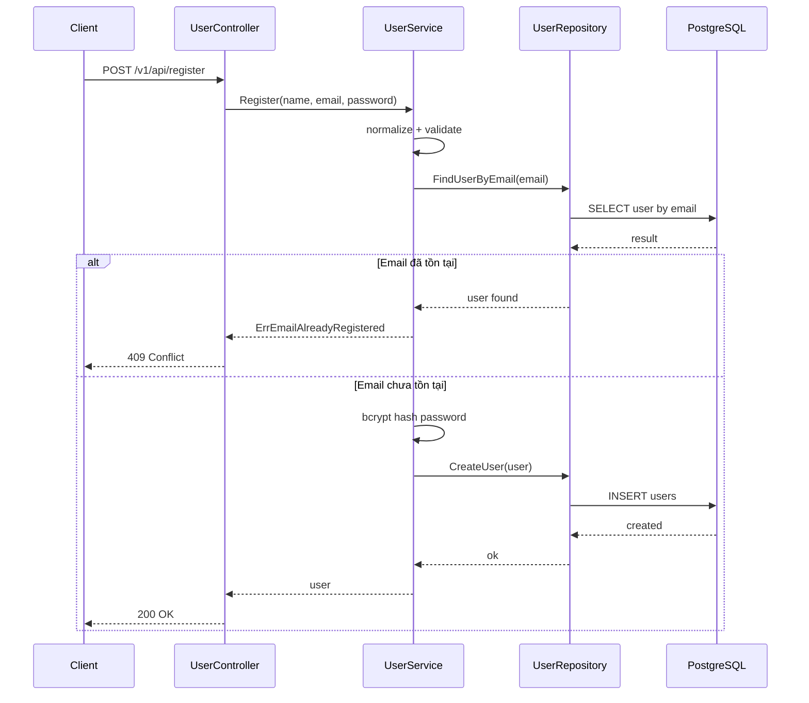
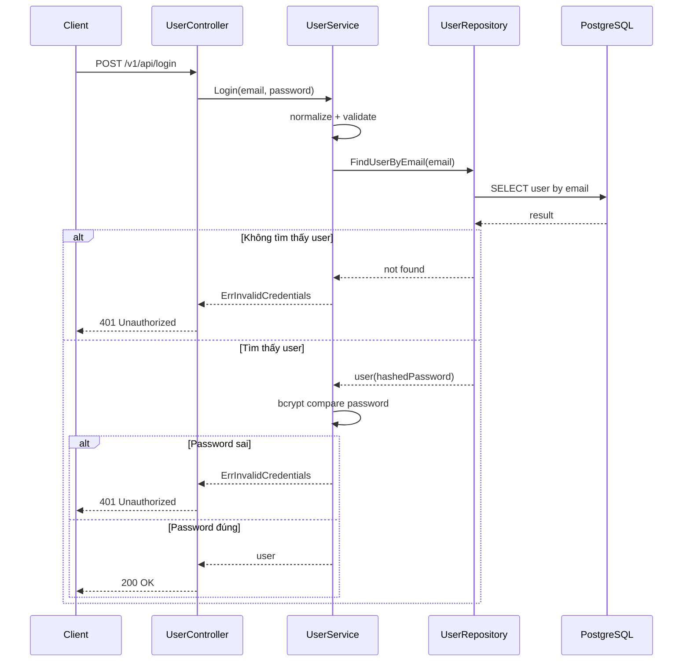
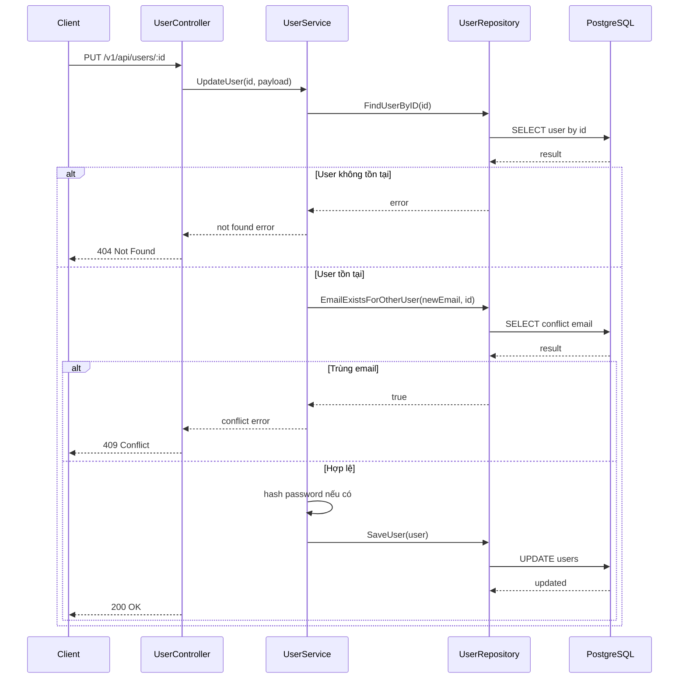
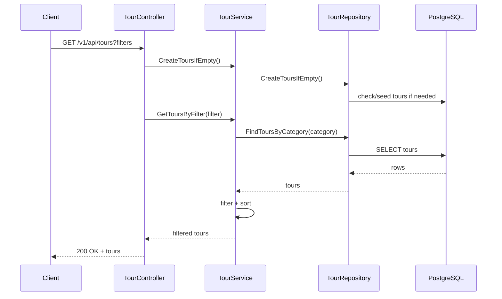
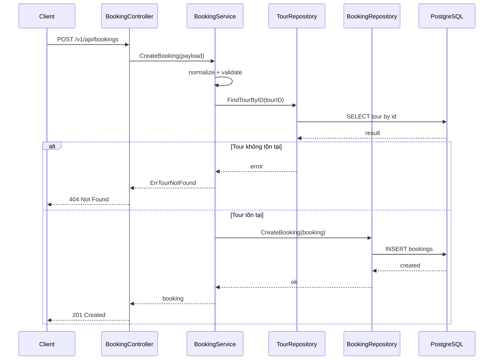

# Traveling Backend

Tài liệu này mô tả kiến trúc backend, nghiệp vụ và luồng hoạt động cho từng chức năng trong hệ thống.

## 1. Tổng quan kiến trúc

Backend sử dụng:
- `Gin` cho HTTP API
- `GORM` để thao tác dữ liệu
- `PostgreSQL` để lưu trữ

Thiết kế theo 3 tầng:
- `controllers/`: nhận request, gọi service, trả response
- `services/`: xử lý business logic, validate nghiệp vụ
- `repositories/`: đọc/ghi database

Luồng tổng quát:
1. Client gọi API.
2. Controller bind JSON/query và chuyển sang service.
3. Service chuẩn hóa dữ liệu, validate nghiệp vụ, gọi repository.
4. Repository thao tác DB bằng GORM.
5. Controller map lỗi sang HTTP status và trả JSON.

## 2. Khởi động backend

Thiết lập nhanh PostgreSQL + pgAdmin:

```bash
docker compose -f docker-compose.pgadmin.yml up -d
```

Thông tin mặc định:
- PostgreSQL: `localhost:5432` (`postgres` / `123456`)
- pgAdmin: `http://localhost:5050` (`admin@traveling.local` / `admin123`)

Sau đó tạo file môi trường từ mẫu:

```bash
cp .env.example .env
```

Từ thư mục `server/`:

```bash
go run main.go
```

Server chạy tại `http://localhost:8080`.

Khi khởi động, `main.go` thực hiện:
1. `database.Connect()` kết nối PostgreSQL.
2. `AutoMigrate` cho các bảng `users`, `tours`, `bookings`.
3. `seedData()` thêm dữ liệu mẫu khi bảng đang trống.
4. Đăng ký routes dưới prefix `/v1`.

## 3. Danh sách API

Base path: `/v1`

- `GET /api/tours`
- `GET /api/tours/domestic`
- `POST /api/bookings`
- `POST /api/register`
- `POST /api/login`
- `PUT /api/users/:id`

## 4. Nghiệp vụ theo từng chức năng

### 4.1 Đăng ký tài khoản (`POST /api/register`)

File liên quan:
- `controllers/user_controller.go`
- `services/user_service.go`
- `repositories/user_repository.go`

Luồng xử lý:
1. Controller bind body vào `RegisterRequest`.
2. Service chuẩn hóa input:
    - `name`: `TrimSpace`
    - `email`: `TrimSpace + ToLower`
3. Service validate:
    - tên không rỗng
    - email đúng định dạng
    - mật khẩu tối thiểu 8 ký tự
4. Service kiểm tra email đã tồn tại chưa.
5. Service hash mật khẩu bằng `bcrypt.GenerateFromPassword`.
6. Repository tạo user mới trong DB.
7. Trả `AuthResponse` thành công (không lộ password vì model dùng `json:"-"`).

HTTP lỗi điển hình:
- `400`: dữ liệu không hợp lệ
- `409`: email đã đăng ký
- `500`: lỗi hệ thống

Sơ đồ luồng:



### 4.2 Đăng nhập (`POST /api/login`)

File liên quan:
- `controllers/user_controller.go`
- `services/user_service.go`
- `repositories/user_repository.go`

Luồng xử lý:
1. Controller bind body vào `LoginRequest`.
2. Service chuẩn hóa email và validate input.
3. Repository tìm user theo email.
4. Service so sánh mật khẩu bằng `bcrypt.CompareHashAndPassword`.
5. Nếu đúng, trả user.
6. Nếu sai email hoặc password, luôn trả thông điệp chung để tránh lộ thông tin tài khoản.

HTTP lỗi điển hình:
- `400`: dữ liệu không hợp lệ
- `401`: email hoặc mật khẩu không đúng
- `500`: lỗi hệ thống

Sơ đồ luồng:



### 4.3 Cập nhật thông tin người dùng (`PUT /api/users/:id`)

File liên quan:
- `controllers/user_controller.go`
- `services/user_service.go`
- `repositories/user_repository.go`

Luồng xử lý:
1. Controller đọc `:id` và bind `UpdateUserRequest`.
2. Service tìm user hiện tại theo ID.
3. Nếu đổi email, kiểm tra email mới không trùng tài khoản khác.
4. Chỉ cập nhật trường được gửi lên (`name`, `email`, `password`).
5. Nếu có đổi password, hash bằng bcrypt trước khi lưu.
6. Repository lưu thay đổi bằng `Save`.

Sơ đồ luồng:



### 4.4 Lấy danh sách tour (`GET /api/tours`, `GET /api/tours/domestic`)

File liên quan:
- `controllers/tour_controller.go`
- `services/tour_service.go`
- `repositories/tour_repository.go`

Luồng xử lý:
1. Controller đảm bảo luôn có dữ liệu tour cơ bản (`CreateToursIfEmpty`).
2. Đọc query filter: `category`, `q/city`, `duration`, `price`, `sort`.
3. Service lấy danh sách theo category.
4. Service lọc theo thành phố, thời lượng, mức giá.
5. Service sắp xếp theo tiêu chí (`price`, `duration`, `name`, `latest`).
6. Trả danh sách tour.

Sơ đồ luồng:



### 4.5 Đặt tour (`POST /api/bookings`)

File liên quan:
- `controllers/booking_controller.go`
- `services/booking_service.go`
- `repositories/booking_repository.go`

Luồng xử lý:
1. Controller bind body vào `CreateBookingRequest`.
2. Service normalize dữ liệu (`full_name`, `phone`, `email`, `travel_date`, `note`).
3. Service validate:
    - `tour_id` hợp lệ
    - `full_name` không rỗng
    - `phone` đúng regex
    - `email` đúng định dạng
    - `quantity > 0`
    - `travel_date` đúng định dạng `YYYY-MM-DD`, không ở quá khứ
4. Service kiểm tra tour tồn tại.
5. Tạo booking với trạng thái mặc định `booked`.
6. Repository lưu booking.
7. Controller trả `201 Created`.

Sơ đồ luồng:



## 5. Quy tắc bảo mật chính

1. Không lưu mật khẩu dạng plain text trong DB.
2. Mọi mật khẩu phải hash bằng `bcrypt` trước khi lưu.
3. Đăng nhập chỉ so sánh hash bằng `CompareHashAndPassword`.
4. Trường `password` trong model `User` luôn bị ẩn khỏi JSON response (`json:"-"`).

## 6. Cấu trúc thư mục backend

```text
server/
   main.go
   controllers/
   services/
   repositories/
   models/
   database/
   init_database.sql
```

## 7. Tài liệu liên quan

- `server/DATABASE_SETUP.md`: hướng dẫn cấu hình database
- `server/init_database.sql`: script SQL tham khảo
